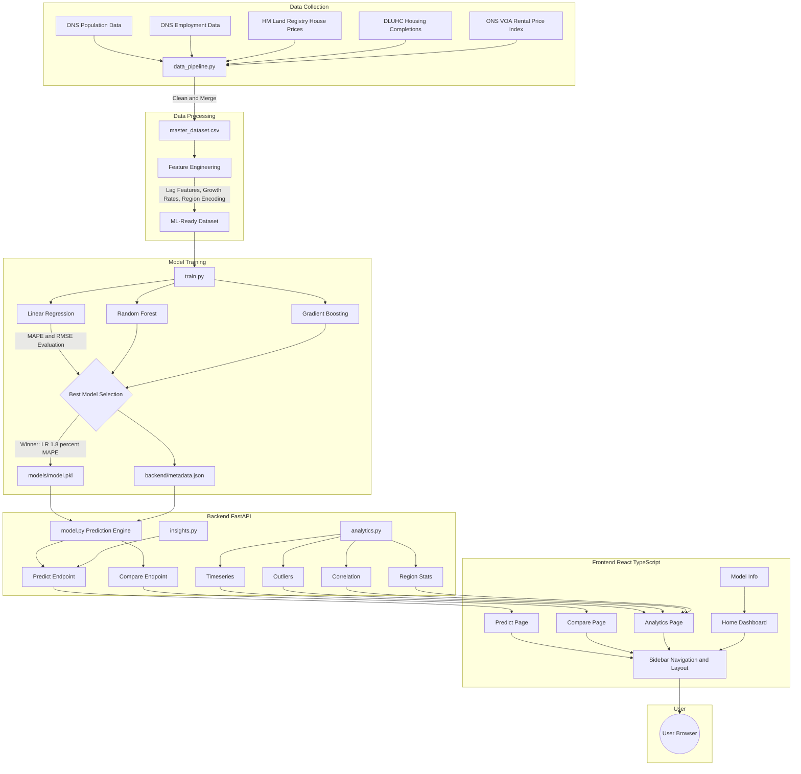
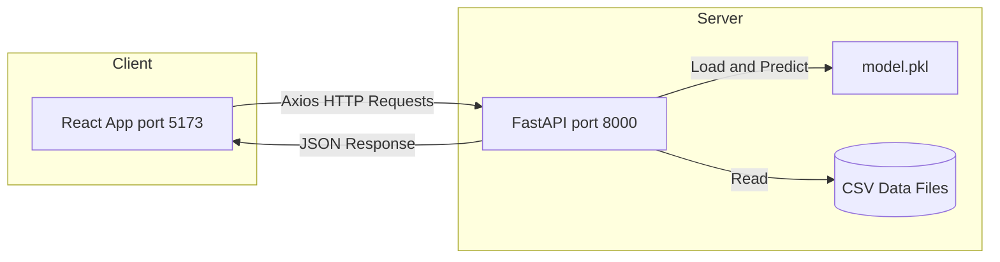
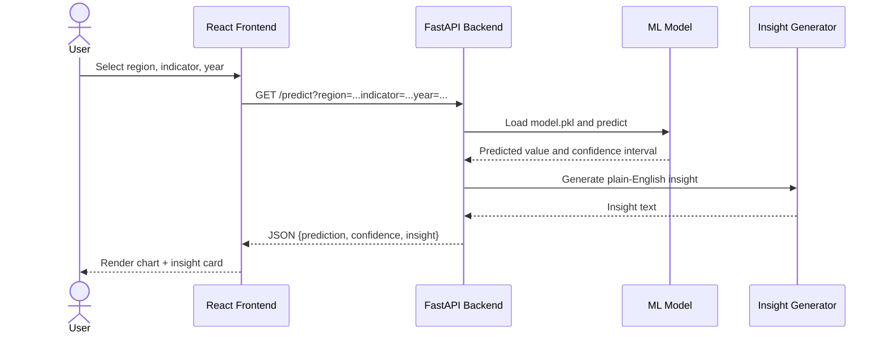

# UK Regional Insight Web App

TerraSight is a full-stack web application that forecasts key socioeconomic indicators across 9 English regions from 2025 to 2035. It leverages machine learning models trained on publicly available UK government data to generate predictions with confidence intervals and plain-English insights.

### What It Predicts

| Indicator | Source |
|-----------|--------|
| Population Estimates | ONS |
| Employment Rate (%) | ONS / NOMIS |
| Average House Price (GBP) | HM Land Registry |
| Rental Price Index | ONS / VOA |
| Housing Completions | DLUHC |

### Regions Covered

East Midlands, East of England, London, North East, North West, South East, South West, West Midlands, and Yorkshire and The Humber.

### How It Works

1. **Data Pipeline** — Raw CSV files from UK government sources are cleaned, merged, and standardised into a single master dataset.
2. **Model Training** — Three models (Linear Regression, Random Forest, Gradient Boosting) are trained and evaluated on MAPE and RMSE. The best performer (Linear Regression with ~1.8% average MAPE) is exported for use by the API.
3. **Backend API** — A FastAPI server loads the trained model and serves predictions, comparisons, and analytics through REST endpoints.
4. **Frontend Dashboard** — A React + TypeScript interface (built with Vite) lets users explore predictions, compare regions side by side, and view advanced analytics with interactive charts.

### Tech Stack

| Layer | Technology |
|-------|------------|
| Backend | Python, FastAPI, Uvicorn, scikit-learn, Pandas |
| Frontend | React 19, TypeScript, Vite, Tailwind CSS, Recharts |
| ML Models | Linear Regression, Random Forest, Gradient Boosting (via scikit-learn and XGBoost) |
| Data | UK Open Government data (OGL v3.0) |

## Workflow Diagram



## System Architecture



## Request Flow



## Project layout

```
data/raw/              raw government CSVs
data/processed/        cleaned master_dataset.csv
notebooks/eda.ipynb    exploratory data analysis
models/model.pkl       trained model (best of 3)
backend/               FastAPI REST API
frontend/              React dashboard (Vite + TS)
data_pipeline.py       data cleaning + merge script
train.py               trains LR, RF, GB — picks the best
```

## Setup

**Backend**
```bash
cd backend
python -m venv venv && source venv/bin/activate
pip install -r requirements.txt
uvicorn main:app --reload
```
API docs: http://localhost:8000/docs

**Frontend**
```bash
cd frontend
npm install
npm run dev
```
Opens at http://localhost:5173

## Training the models

```bash
pip install -r requirements.txt   # root-level requirements
python train.py
```

This trains Linear Regression, Random Forest, and Gradient Boosting on the dataset,
compares MAPE and RMSE, and saves the winner to `models/model.pkl`. All three
models came in under the 8% MAPE target — LR ended up winning with ~1.8% average MAPE
across the five indicators, which was a bit surprising honestly.

## API

| Endpoint | What it does |
|----------|-------------|
| GET /predict?region=London&indicator=population&year=2030 | prediction + confidence interval + insight text |
| GET /compare?region1=London&region2=North West&indicator=employment_rate&year=2030 | side-by-side comparison |
| GET /regions | list of regions |
| GET /indicators | list of indicators |

There are also some extra analytics endpoints (/analytics/timeseries, /analytics/outliers,
/analytics/correlation, /analytics/stats/regions) that power the analytics page.

## Data

All from UK government sources under the Open Government Licence (OGL v3.0):

- ONS — population estimates, employment rates
- HM Land Registry — average house prices
- DLUHC — housing completions
- ONS/VOA — rental price index
- NOMIS — cross-referencing employment data

See `references/` folder for full URLs and citations.

## Known limitations

- Housing completions has the highest MAPE (~6.5%) — it's the most volatile indicator
  and the model struggles a bit with it. Could probably improve with more features.
- Confidence intervals are approximate (based on MAPE margin, not proper prediction intervals).
- Only covers 9 English regions, not Scotland/Wales/NI.
- Model assumes trends continue linearly which may not hold after economic shocks.

---
Bera Aksoy | T0407452 | Nottingham Trent University
