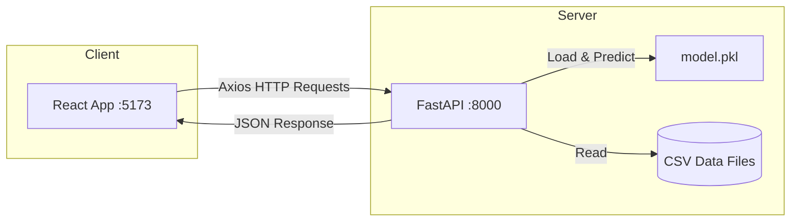
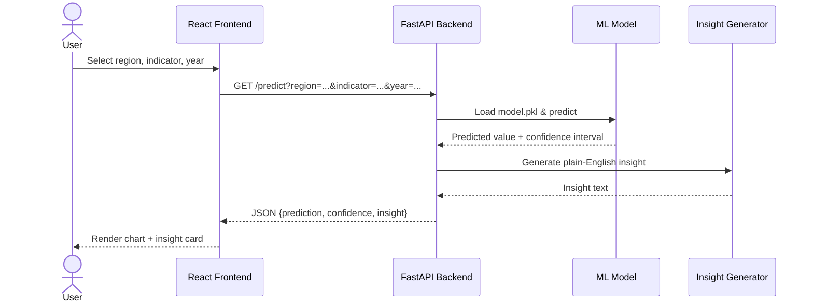

# UK Regional Insight Web App

Predicts socioeconomic indicators (population, employment, housing prices, rentals,
housing completions) for 9 English regions out to 2035, using ML models trained on
open government data.

Built with FastAPI (Python) on the backend and React + TypeScript on the frontend.

## Workflow Diagram

```mermaid
flowchart TD
    subgraph Data Collection
        A1[ONS Population Data] --> B[data_pipeline.py]
        A2[ONS Employment Data] --> B
        A3[HM Land Registry House Prices] --> B
        A4[DLUHC Housing Completions] --> B
        A5[ONS/VOA Rental Price Index] --> B
    end

    subgraph Data Processing
        B -->|Clean & Merge| C[data/processed/master_dataset.csv]
        C --> D[Feature Engineering]
        D -->|Lag Features, Growth Rates, Region Encoding| E[ML-Ready Dataset]
    end

    subgraph Model Training
        E --> F[train.py]
        F --> G1[Linear Regression]
        F --> G2[Random Forest]
        F --> G3[Gradient Boosting]
        G1 -->|MAPE + RMSE Evaluation| H{Best Model Selection}
        G2 --> H
        G3 --> H
        H -->|Winner: LR ~1.8% MAPE| I[models/model.pkl]
        H --> J[backend/metadata.json]
    end

    subgraph Backend - FastAPI
        I --> K[model.py - Prediction Engine]
        J --> K
        K --> L[/predict - Single Prediction]
        K --> M[/compare - Region Comparison]
        N[analytics.py] --> O[/analytics/timeseries]
        N --> P[/analytics/outliers]
        N --> Q[/analytics/correlation]
        N --> R[/analytics/stats/regions]
        S[insights.py] --> L
    end

    subgraph Frontend - React + TypeScript
        L --> T[Predict Page]
        M --> U[Compare Page]
        O & P & Q & R --> V[Analytics Page]
        W[/model/info] --> X[Home Dashboard]
        T & U & V & X --> Y[Sidebar Navigation + Layout]
    end

    subgraph User
        Y --> Z((User Browser))
    end
```

## System Architecture



## Request Flow



## Project layout

```
data/raw/              raw government CSVs
data/processed/        cleaned master_dataset.csv
notebooks/eda.ipynb    exploratory data analysis
models/model.pkl       trained model (best of 3)
backend/               FastAPI REST API
frontend/              React dashboard (Vite + TS)
data_pipeline.py       data cleaning + merge script
train.py               trains LR, RF, GB — picks the best
```

## Setup

**Backend**
```bash
cd backend
python -m venv venv && source venv/bin/activate
pip install -r requirements.txt
uvicorn main:app --reload
```
API docs: http://localhost:8000/docs

**Frontend**
```bash
cd frontend
npm install
npm run dev
```
Opens at http://localhost:5173

## Training the models

```bash
pip install -r requirements.txt   # root-level requirements
python train.py
```

This trains Linear Regression, Random Forest, and Gradient Boosting on the dataset,
compares MAPE and RMSE, and saves the winner to `models/model.pkl`. All three
models came in under the 8% MAPE target — LR ended up winning with ~1.8% average MAPE
across the five indicators, which was a bit surprising honestly.

## API

| Endpoint | What it does |
|----------|-------------|
| GET /predict?region=London&indicator=population&year=2030 | prediction + confidence interval + insight text |
| GET /compare?region1=London&region2=North West&indicator=employment_rate&year=2030 | side-by-side comparison |
| GET /regions | list of regions |
| GET /indicators | list of indicators |

There are also some extra analytics endpoints (/analytics/timeseries, /analytics/outliers,
/analytics/correlation, /analytics/stats/regions) that power the analytics page.

## Data

All from UK government sources under the Open Government Licence (OGL v3.0):

- ONS — population estimates, employment rates
- HM Land Registry — average house prices
- DLUHC — housing completions
- ONS/VOA — rental price index
- NOMIS — cross-referencing employment data

See `references/` folder for full URLs and citations.

## Known limitations

- Housing completions has the highest MAPE (~6.5%) — it's the most volatile indicator
  and the model struggles a bit with it. Could probably improve with more features.
- Confidence intervals are approximate (based on MAPE margin, not proper prediction intervals).
- Only covers 9 English regions, not Scotland/Wales/NI.
- Model assumes trends continue linearly which may not hold after economic shocks.

---
Bera Aksoy | T0407452 | Nottingham Trent University
